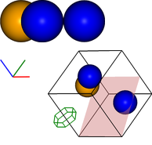
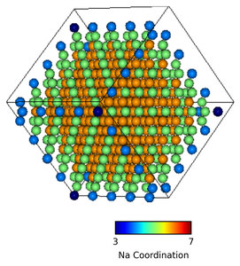
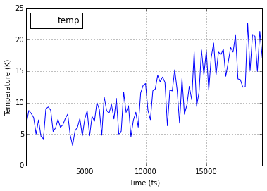

# IPython Molecular Dynamics Analysis (ipymd)
Analysis of Molecular Dynamics output in the IPython Notebook


This package aims to provide a means of producing **reusable** analysis of Molecular Dynamics (MD) output in the IPython Notebook. 

There are many programs for 3D visualisation of MD output (my favourite being [Ovito](http://www.ovito.org/index.php)). However, there lacks a means to produce a more thorough, documented analysis of the data. IPython Notebooks are ideal for this type of analysis and so the objective of `ipymd` is to produce a Python package that can be used in conjuction with programmes like Ovito, to produce documented and reuseable analysis.  

The aim of `ipymd` is to produce IPython Notebooks that include:

- Static images of the simulations
- Analysis of simulation data, including graphical plots

It has been created with the goal to be:

- Easy to use
- Easy to extend

It will build primarily on the [chemlab](http://chemlab.readthedocs.io/en/latest/) package, that is an API layer on top of OpenGL. It will also aim to parse data in simple formats, such as [pandas](http://pandas.pydata.org/) dataframes, which are easy to create and use independantly from this package, in order to extend its functionality.  

## User Tutorial

### Instillation of Dependant Packages

[Anaconda](https://www.continuum.io/) is recommended to create a Python environment within which to use ipymd:

    conda create -n ipymd -c http://conda.binstar.org/gabrielelanaro chemlab matplotlib pandas ipython ipython-notebook pil pyopengl==3.0.2


```python
%matplotlib inline
import ipymd
print ipymd.version()
```

    0.0.2


### Basic Atom Creation and Visualisation

The input for a basic atomic visualisation, is a [pandas](http://pandas.pydata.org/) Dataframe that specifies the coordinates, size and color of each atom in the following manner:


```python
import pandas as pd
df = pd.DataFrame(
        [[2,3,4,1,[0, 0, 255],1],
         [1,3,3,1,'orange',1],
         [4,3,1,1,'blue',1]],
        columns=['x','y','z','radius','color','transparency'])
```

Distances are measured in Angstroms, and colors can be defined in [r,g,b] format (0 to 255) or as a string defined in `available_colors`.


```python
print ipymd.available_colors()['reds']
```

    ['light_salmon', 'salmon', 'dark_salmon', 'light_coral', 'indian_red', 'crimson', 'fire_brick', 'dark_red', 'red']


The `Visualise_Sim` class can then be used to setup a visualisation, which is returned in the form of a `PIL` image.


```python
vis = ipymd.visualise_sim.Visualise_Sim()
vis.add_atoms(df)
img1 = vis.get_image()
img1
```


    <PIL.Image._ImageCrop image mode=RGBA size=134x54 at 0x1177C2950>


To convert this into an image viewable in IPython, simply parse it to the `visualise` function.


```python
vis.visualise(img1)
```


Extending this basic procedure, additional objects can be added to the visualisation, the viewpoint can be rotated and multiple images can be output at once, as shown in the following example:


```python
vis.add_axes(length=0.2, offset=(-0.3,0))
vis.add_box([[5,0,0],[0,5,0],[0,0,5]])
vis.add_plane([[5,0,0],[0,5,2]],alpha=0.3)
vis.add_hexagon([[1,0,0],[0,0,.5]],[0,0,2],color='green')

img2 = vis.get_image(xrot=45, yrot=45)
vis.visualise([img1,img2])
```





### Atom Creation From Other Sources

The `ipymd.data_input` module includes a number of classes to automate the intial creation of the atoms Dataframe, from various sources. Most classes will return a sub-class of `DataInput`, with a `get_atoms` method to return the atoms Dataframe and a `get_simulation_box` method to return the vertexes and origin of the simulation box.

#### Crystal Parameters

This class allows atoms to be created in ordered crystal, as defined by their space group and crystal parameters:


```python
data = ipymd.data_input.crystal.Crystal(
    [[0.0, 0.0, 0.0], [0.5, 0.5, 0.5]], ['Na', 'Cl'], 
    225, cellpar=[.54, .54, .54, 90, 90, 90], 
    repetitions=[5, 5, 5])

sim_abc, sim_origin = data.get_simulation_box()
print sim_origin
print sim_abc
atoms_df = data.get_atom_data()
atoms_df.head(2)
```

    [ 0.  0.  0.]
    [[  2.70000000e+01   0.00000000e+00   0.00000000e+00]
     [  1.65327318e-15   2.70000000e+01   0.00000000e+00]
     [  1.65327318e-15   1.65327318e-15   2.70000000e+01]]


<div>
<table border="1" class="dataframe">
  <thead>
    <tr style="text-align: right;">
      <th></th>
      <th>id</th>
      <th>type</th>
      <th>x</th>
      <th>y</th>
      <th>z</th>
      <th>transparency</th>
      <th>color</th>
      <th>radius</th>
    </tr>
  </thead>
  <tbody>
    <tr>
      <th>0</th>
      <td>1</td>
      <td>Na</td>
      <td>0.000000e+00</td>
      <td>0.0</td>
      <td>0.0</td>
      <td>1</td>
      <td>light_salmon</td>
      <td>1</td>
    </tr>
    <tr>
      <th>1</th>
      <td>2</td>
      <td>Na</td>
      <td>3.306546e-16</td>
      <td>2.7</td>
      <td>2.7</td>
      <td>1</td>
      <td>light_salmon</td>
      <td>1</td>
    </tr>
  </tbody>
</table>
</div>


```python
vis2 = ipymd.visualise_sim.Visualise_Sim()
vis2.add_axes()
vis2.add_box(sim_abc, sim_origin)
vis2.add_atoms(atoms_df)
images = [vis2.get_image(xrot=xrot,yrot=45) for xrot in [0,45]]
vis2.visualise(images, columns=2)
```


A dataframe is available which lists the alternative names for each space group:


```python
df = ipymd.data_input.crystal.get_spacegroup_df()
df.loc[[1,225]]
```


<div>
<table border="1" class="dataframe">
  <thead>
    <tr style="text-align: right;">
      <th></th>
      <th>System_type</th>
      <th>Point group</th>
      <th>Short_name</th>
      <th>Full_name</th>
      <th>Schoenflies</th>
      <th>Fedorov</th>
      <th>Shubnikov</th>
      <th>Fibrifold</th>
    </tr>
    <tr>
      <th>Number</th>
      <th></th>
      <th></th>
      <th></th>
      <th></th>
      <th></th>
      <th></th>
      <th></th>
      <th></th>
    </tr>
  </thead>
  <tbody>
    <tr>
      <th>1</th>
      <td>triclinic</td>
      <td>1</td>
      <td>P1</td>
      <td>P 1</td>
      <td>$C_1^1$</td>
      <td>1s</td>
      <td>$(a/b/c)\cdot 1$</td>
      <td>-</td>
    </tr>
    <tr>
      <th>225</th>
      <td>cubic</td>
      <td>4/m 3 2/m</td>
      <td>Fm3m</td>
      <td>F 4/m 3 2/m</td>
      <td>$O_h^5$</td>
      <td>73s</td>
      <td>$\left ( \frac{a+c}{2}/\frac{b+c}{2}/\frac{a+b...</td>
      <td>$2^{-}:2$</td>
    </tr>
  </tbody>
</table>
</div>


#### Crystallographic Information Files

.cif files are a common means to store crystallographic data and can be loaded as follows:


```python
cif_path = ipymd.get_test_path('example_crystal.cif')
data = ipymd.data_input.cif.CIF(cif_path)
vis = ipymd.visualise_sim.Visualise_Sim()
vis.basic_vis(data.get_atom_data(), data.get_simulation_box(),
              xrot=45,yrot=45)
```


NB: at present, fractional occupancies of lattice sites are returned in the atom Dataframe, but cannot be visualised as such. It is intended that eventually occupancy will be visualised by partial spheres. 


```python
data.get_atom_data().head(1)
```


<div>
<table border="1" class="dataframe">
  <thead>
    <tr style="text-align: right;">
      <th></th>
      <th>type</th>
      <th>x</th>
      <th>y</th>
      <th>z</th>
      <th>occupancy</th>
      <th>transparency</th>
      <th>color</th>
      <th>radius</th>
    </tr>
  </thead>
  <tbody>
    <tr>
      <th>0</th>
      <td>Fe</td>
      <td>4.363536</td>
      <td>2.40065</td>
      <td>22.642804</td>
      <td>1</td>
      <td>1</td>
      <td>light_salmon</td>
      <td>1</td>
    </tr>
  </tbody>
</table>
</div>


#### Lammps Input Data

The input data for LAMMPS simulations (supplied to `read_data`) can be input. Note that the `get_atom_data` method requires that the atom_style is defined, in order to define what each data column refers to.


```python
lammps_path = ipymd.get_test_path('lammps_input.data')
data = ipymd.data_input.lammps.LAMMPS_Input(lammps_path)

vis = ipymd.visualise_sim.Visualise_Sim()
vis.basic_vis(data.get_atom_data(atom_style='charge'), data.get_simulation_box(),xrot=45,yrot=45)
```


#### Lammps Output Data

Output data can be read in the form of a single file or, it is advisable for efficiency, that a single file is output for each timestep, where `*` is used to define the variable section of the filename. The `get_atoms` and `get_simulation_box` methods not take a variable to define which timestep is returned.


```python
lammps_path = ipymd.get_test_path('atom_onefile.dump')
data = ipymd.data_input.lammps.LAMMPS_Output(lammps_path)

vis = ipymd.visualise_sim.Visualise_Sim()
vis.basic_vis(data.get_atom_data(98), data.get_simulation_box(98),
              spheres=True,xrot=45,yrot=45)
```


```python
lammps_path = ipymd.get_test_path(['atom_dump','atoms_*.dump'])
data = ipymd.data_input.lammps.LAMMPS_Output(lammps_path)
print data.count_timesteps()

vis = ipymd.visualise_sim.Visualise_Sim()
vis.basic_vis(data.get_atom_data(98), data.get_simulation_box(98),
              spheres=False,xrot=90,yrot=0)
```

    98


### Atom Manipulation

The atoms Dataframe is already very easy to manipulate using the standard [pandas](http://pandas.pydata.org/) methods. But an `Atom_Manipulation` class has also been created to carry out standard atom manipulations, such as setting variables dependant on atom type or altering the geometry, as shown in this example:


```python
data = ipymd.data_input.crystal.Crystal(
    [[0.0, 0.0, 0.0], [0.5, 0.5, 0.5]], ['Na', 'Cl'], 
    225, cellpar=[.54, .54, .54, 90, 90, 90], 
    repetitions=[5, 5, 5])

manipulate_atoms = ipymd.atom_manipulation.Atom_Manipulation

new_df = manipulate_atoms(data.get_atom_data())

new_df.apply_radiimap({'Na':1.5, 'Cl':1})
new_df.apply_colormap({'Na':'blue','Cl':'green'})
new_df.change_type_variable('Na', 'transparency', 0.5)
new_df.slice_z(10,20)

vis2 = ipymd.visualise_sim.Visualise_Sim()
vis2.add_box(*data.get_simulation_box())
vis2.add_axes(offset=(-1.3,-0.7))
vis2.add_atoms(new_df.df, spheres=True)

img1 = vis2.get_image(xrot=45,yrot=45)

vis2.remove_atoms()
new_df.repeat_cell(data.get_simulation_box()[0],((-1,1),(-1,1),(-1,1)))
new_df.color_by_variable('z')
vis2.add_atoms(new_df.df, spheres=True)
img2 = vis2.get_image(xrot=90,yrot=0)
img2 = vis2.draw_colormap(img2,minv=new_df.df.z.min(), maxv=new_df.df.z.max(),
                          bottom=0.05,left=0.52,size=(200,200))

vis2.visualise([img1,img2], columns=2)
```


NB: the default radii map is by atom  Van der Waals radii (`ipymd.atom_manipulation.vdw_dict`) and the default color map is by the same as in chemlab (`ipymd.atom_manipulation.default_atom_map`).

### Geometric Analysis

Given the simple and flexible form of the atomic data and visualisation, it is now easier to add more complex geometric analysis. These analyses are being contained in the `Atom_Analysis` class, and some initial examples are detailed below:

#### Atomic Coordination

The two examples below show computation of the coordination of Na, w.r.t Cl, in a simple NaCl crystal (which should be 6). The first does not include a consideration of the repeating boundary conditions, and so outer atoms have a lower coordination number. But the latter computation provides a method which takes this into consideration, by repeating the Cl lattice in each direction before computation.


```python
data = ipymd.data_input.crystal.Crystal(
    [[0.0, 0.0, 0.0], [0.5, 0.5, 0.5]], ['Na', 'Cl'], 
    225, cellpar=[.54, .54, .54, 90, 90, 90], 
    repetitions=[5, 5, 5])
df = data.get_atom_data()
df['coord'] = 0

analysis = ipymd.atom_analysis.Atom_Analysis()

coord_df = manipulate_atoms(df)
coord_df.filter_variables('Na')

lattice_df = manipulate_atoms(df)
lattice_df.filter_variables('Cl')

na_coord = analysis.calc_coordination(coord_df.df,lattice_df.df)

df.loc[df['type'] == 'Na','coord'] = na_coord

new_df = manipulate_atoms(df)
new_df.filter_variables('Na')
new_df.color_by_variable('coord',minv=3,maxv=7)

vis = ipymd.visualise_sim.Visualise_Sim()
vis.add_box(*data.get_simulation_box())
vis.add_atoms(new_df.df)

img = vis.get_image(xrot=45,yrot=45)
img = vis.draw_colormap(img,minv=3,maxv=7,text='Na Coordination')

vis.visualise(img)
```





```python
data = ipymd.data_input.crystal.Crystal(
    [[0.0, 0.0, 0.0], [0.5, 0.5, 0.5]], ['Na', 'Cl'], 
    225, cellpar=[.54, .54, .54, 90, 90, 90], 
    repetitions=[5, 5, 5])
df = data.get_atom_data()

df = analysis.calc_type_coordination(df, 'Na','Cl',repeat_vectors=data.get_simulation_box()[0])

new_df = manipulate_atoms(df)
new_df.filter_variables('Na')
new_df.color_by_variable('coord_Na_Cl',minv=3,maxv=7)

vis = ipymd.visualise_sim.Visualise_Sim()
vis.add_box(*data.get_simulation_box())
vis.add_atoms(new_df.df)

img = vis.get_image(xrot=45,yrot=45)
img = vis.draw_colormap(img,minv=3,maxv=7,text='Na Coordination')

vis.visualise(img)
```


#### Atomic Structure Comparison

`compare_to_lattice` takes each atomic coordinate in df1 and computes the distance to the nearest atom (i.e. lattice site) in df2:


```python
import numpy as np
data1 = ipymd.data_input.crystal.Crystal(
    [[0.0, 0.0, 0.0], [0.5, 0.5, 0.5]], ['Na', 'Cl'], 
    225, cellpar=[.54, .54, .54, 90, 90, 90], 
    repetitions=[5, 5, 5])
df1 = data1.get_atom_data()

print ('Average distance to nearest atom (identical)', 
       np.mean(analysis.compare_to_lattice(df1,df1)))

data2 = ipymd.data_input.crystal.Crystal(
    [[0.0, 0.0, 0.0], [0.5, 0.5, 0.5]], ['Na', 'Cl'], 
    225, cellpar=[.541, .54, .54, 90, 90, 90], 
    repetitions=[5, 5, 5])
df2 = data2.get_atom_data()

print ('Average distance to nearest atom (different)', 
       np.mean(analysis.compare_to_lattice(df1,df2)))

```

    ('Average distance to nearest atom (identical)', 0.0)
    ('Average distance to nearest atom (different)', 0.022499999999999343)


### System Analysis

Within the `LAMMPS_Output` class there is also the option to read in a systems data file, with a log of global variables for each simulation timestep.


```python
data = ipymd.data_input.lammps.LAMMPS_Output(
    sys_path=ipymd.get_test_path('system.dump'))
```


```python
sys_data = data.get_system_data()
sys_data.tail()
```


<div>
<table border="1" class="dataframe">
  <thead>
    <tr style="text-align: right;">
      <th></th>
      <th>time</th>
      <th>natoms</th>
      <th>a</th>
      <th>b</th>
      <th>vol</th>
      <th>press</th>
      <th>temp</th>
      <th>peng</th>
      <th>keng</th>
      <th>teng</th>
      <th>enth</th>
    </tr>
  </thead>
  <tbody>
    <tr>
      <th>94</th>
      <td>18800</td>
      <td>5880</td>
      <td>4.000919</td>
      <td>4.000920</td>
      <td>106961.684112</td>
      <td>3984.476256</td>
      <td>20.821004</td>
      <td>-576758.385663</td>
      <td>364.871078</td>
      <td>-576393.514586</td>
      <td>-570178.024689</td>
    </tr>
    <tr>
      <th>95</th>
      <td>19000</td>
      <td>5880</td>
      <td>4.002667</td>
      <td>4.002667</td>
      <td>107055.104770</td>
      <td>3457.822223</td>
      <td>20.543535</td>
      <td>-576743.788115</td>
      <td>360.008650</td>
      <td>-576383.779465</td>
      <td>-570985.120033</td>
    </tr>
    <tr>
      <th>96</th>
      <td>19200</td>
      <td>5880</td>
      <td>3.995696</td>
      <td>3.995696</td>
      <td>106682.545808</td>
      <td>1880.020740</td>
      <td>14.949236</td>
      <td>-576635.072775</td>
      <td>261.973143</td>
      <td>-576373.099632</td>
      <td>-573448.059018</td>
    </tr>
    <tr>
      <th>97</th>
      <td>19400</td>
      <td>5880</td>
      <td>3.990131</td>
      <td>3.990134</td>
      <td>106385.666301</td>
      <td>499.341106</td>
      <td>21.315529</td>
      <td>-576735.710976</td>
      <td>373.537223</td>
      <td>-576362.173753</td>
      <td>-575587.433134</td>
    </tr>
    <tr>
      <th>98</th>
      <td>19600</td>
      <td>5880</td>
      <td>3.979611</td>
      <td>3.979609</td>
      <td>105825.294988</td>
      <td>-2300.315883</td>
      <td>17.161320</td>
      <td>-576652.409368</td>
      <td>300.738098</td>
      <td>-576351.671270</td>
      <td>-579901.871560</td>
    </tr>
  </tbody>
</table>
</div>


```python
ax = sys_data.plot('time','temp')
ax.set_xlabel('Time (fs)')
ax.set_ylabel('Temperature (K)');
ax.grid()
```



