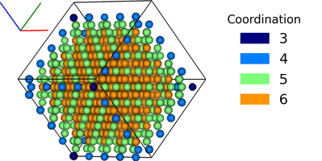

# IPython Molecular Dynamics Analysis (ipyMD)

This package aims to provide a means of producing **reusable** analysis of Molecular Dynamics (MD) output in the IPython Notebook.

See http://ipymd.rtfd.io for the full documentation!




*Analysis of the atomic coordination of Na, wrt Cl, for an NaCl nano-crystal.*

There are many programs for 3D visualisation of MD output (my favourite being [Ovito](http://www.ovito.org/index.php)). However, there lacks a means to produce a more thorough, documented analysis of the data. IPython Notebooks are ideal for this type of analysis and so the objective of `ipymd` is to produce a Python package that can be used in conjuction with programmes like Ovito, to produce documented and reuseable analysis.  

The aim of `ipymd` is to produce IPython Notebooks that include:

- Static images of the simulations
- Analysis of simulation data, including graphical plots

It has been created with the goal to be:

- Easy to use
- Easy to extend

It builds primarily on the [chemlab](http://chemlab.readthedocs.io/en/latest/) package, that is an API layer on top of OpenGL. Data is parsed in standard formats, such as [pandas](http://pandas.pydata.org/) dataframes, which are easy to create and use independantly from this package, in order to extend its functionality.  


### Instillation of Dependant Packages

[Anaconda](https://www.continuum.io/) is recommended to create a Python environment within which to use ipymd:

    conda create -n ipymd -c cjs14 ipymd
    source activate ipymd
    ipython notebook

Currently the conda package is only available for OSX. For other operating systems, see the conda build file for guidance on package dependancies: https://github.com/chrisjsewell/ipymd/blob/master/conda_recipe/meta.yaml

In the IPython Notebook, the ipymd package can then be imported.

```python
import ipymd
print ipymd.version()
```

    0.3.0

