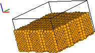

# IPython Molecular Dynamics Analysis (ipymd)
Analysis of Molecular Dynamics output in the IPython Notebook



This package aims to provide a means of producing **reusable** analysis of Molecular Dynamics (MD) output in the IPython Notebook. 

There are many programs for 3D visualisation of MD output (my favourite being [Ovito](http://www.ovito.org/index.php)). However, there lacks a means to produce a more thorough, documented analysis of the data. IPython Notebooks are ideal for this type of analysis and so the objective of `ipymd` is to produce a Python package that can be used in conjuction with programmes like Ovito, to produce documented and reuseable analysis.  

The aim of `ipymd` is to produce IPython Notebooks that include:

- Static images of the simulations
- Plots of simulation data

It will build primarily on the [chemlab](http://chemlab.readthedocs.io/en/latest/) package, that is an API layer on top of OpenGL. It will also aim to parse data in simple formats, such as [pandas](http://pandas.pydata.org/) dataframes, which are easy to create and use independantly from this package.  

## Example Output


```python
%matplotlib inline
import ipymd
```


```python
data = ipymd.md_data.LAMMPS_Data(
    sys_path=ipymd.get_test_path('system.dump'),
    atom_path=ipymd.get_test_path(['atom_dump','atoms_*.dump']))
```


```python
sys_data = data.get_system_data()
sys_data.tail()
```


<div>
<table border="1" class="dataframe">
  <thead>
    <tr style="text-align: right;">
      <th></th>
      <th>time</th>
      <th>natoms</th>
      <th>a</th>
      <th>b</th>
      <th>vol</th>
      <th>press</th>
      <th>temp</th>
      <th>peng</th>
      <th>keng</th>
      <th>teng</th>
      <th>enth</th>
    </tr>
  </thead>
  <tbody>
    <tr>
      <th>94</th>
      <td>18800</td>
      <td>5880</td>
      <td>4.000919</td>
      <td>4.000920</td>
      <td>106961.684112</td>
      <td>3984.476256</td>
      <td>20.821004</td>
      <td>-576758.385663</td>
      <td>364.871078</td>
      <td>-576393.514586</td>
      <td>-570178.024689</td>
    </tr>
    <tr>
      <th>95</th>
      <td>19000</td>
      <td>5880</td>
      <td>4.002667</td>
      <td>4.002667</td>
      <td>107055.104770</td>
      <td>3457.822223</td>
      <td>20.543535</td>
      <td>-576743.788115</td>
      <td>360.008650</td>
      <td>-576383.779465</td>
      <td>-570985.120033</td>
    </tr>
    <tr>
      <th>96</th>
      <td>19200</td>
      <td>5880</td>
      <td>3.995696</td>
      <td>3.995696</td>
      <td>106682.545808</td>
      <td>1880.020740</td>
      <td>14.949236</td>
      <td>-576635.072775</td>
      <td>261.973143</td>
      <td>-576373.099632</td>
      <td>-573448.059018</td>
    </tr>
    <tr>
      <th>97</th>
      <td>19400</td>
      <td>5880</td>
      <td>3.990131</td>
      <td>3.990134</td>
      <td>106385.666301</td>
      <td>499.341106</td>
      <td>21.315529</td>
      <td>-576735.710976</td>
      <td>373.537223</td>
      <td>-576362.173753</td>
      <td>-575587.433134</td>
    </tr>
    <tr>
      <th>98</th>
      <td>19600</td>
      <td>5880</td>
      <td>3.979611</td>
      <td>3.979609</td>
      <td>105825.294988</td>
      <td>-2300.315883</td>
      <td>17.161320</td>
      <td>-576652.409368</td>
      <td>300.738098</td>
      <td>-576351.671270</td>
      <td>-579901.871560</td>
    </tr>
  </tbody>
</table>
</div>


```python
ax = sys_data.plot('time','temp')
ax.set_xlabel('Time (fs)')
ax.set_ylabel('Temperature (K)');
```


```python
print data.get_atom_timestep(98)
atom_data = data.get_atom_data(98)
sim_box = data.get_simulation_box(98)
atom_data.head()
```

    9800


<div>
<table border="1" class="dataframe">
  <thead>
    <tr style="text-align: right;">
      <th></th>
      <th>id</th>
      <th>type</th>
      <th>xs</th>
      <th>ys</th>
      <th>zs</th>
      <th>mass</th>
      <th>q</th>
    </tr>
  </thead>
  <tbody>
    <tr>
      <th>0</th>
      <td>259</td>
      <td>1</td>
      <td>-27.857561</td>
      <td>-21.882633</td>
      <td>7.196651</td>
      <td>55.845</td>
      <td>-1.505560e-07</td>
    </tr>
    <tr>
      <th>1</th>
      <td>267</td>
      <td>1</td>
      <td>-27.861259</td>
      <td>-25.857124</td>
      <td>7.188060</td>
      <td>55.845</td>
      <td>-2.182330e-07</td>
    </tr>
    <tr>
      <th>2</th>
      <td>269</td>
      <td>1</td>
      <td>-25.863859</td>
      <td>-23.880771</td>
      <td>7.181207</td>
      <td>55.845</td>
      <td>-2.916280e-07</td>
    </tr>
    <tr>
      <th>3</th>
      <td>271</td>
      <td>1</td>
      <td>-23.879500</td>
      <td>-21.886533</td>
      <td>7.184821</td>
      <td>55.845</td>
      <td>-2.084570e-07</td>
    </tr>
    <tr>
      <th>4</th>
      <td>279</td>
      <td>1</td>
      <td>-25.866796</td>
      <td>-27.853247</td>
      <td>7.182366</td>
      <td>55.845</td>
      <td>-1.888220e-07</td>
    </tr>
  </tbody>
</table>
</div>


```python
vis = ipymd.visualise_sim.Visualise_Sim()

images = [vis.get_image(atom_data,sim_box,type_dict={1:'Fe'},
         xrot=xrot,yrot=45) for xrot in [0,45,90]]
images.append(vis.get_image(atom_data,sim_box,type_dict={1:'Fe'},
                        xrot=45,yrot=45,spheres=False))
vis.visualise(images, columns=2)
```


